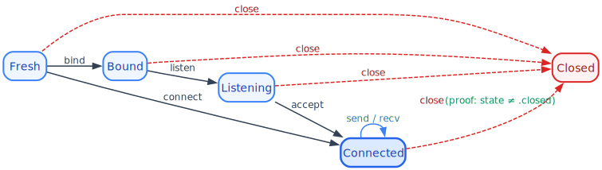

# Zero-Cost POSIX Compliance: Encoding the Socket State Machine in Lean 4's Type System

> *The best runtime check is the one that never runs.*

## The problem

The POSIX socket API is a state machine. A socket must be created, then
bound, then set to listen, before it can accept connections. Calling
operations in the wrong order — `send` on an unconnected socket, `accept`
before `listen`, `close` twice — returns an error code that nothing
forces you to check, and double-close can silently destroy another
thread's file descriptor.

Every production socket library deals with this in one of three ways:

1. **Runtime checks** — assert the state at every call, throw on violation
   (Python, Java, Go).
2. **Documentation** — trust the programmer to read the man page (C, Rust).
3. **Ignore it** — let the OS return `EBADF` and hope someone checks the
   return code.

All three push the bug to runtime. Lean 4 offers a fourth option:
**make the bug unrepresentable at the type level, then erase the proof
at compile time so the generated code is identical to raw C**.

## The state machine

<p align="center">
  
</p>

Five states, seven transitions, and one proof obligation. That is the
entire POSIX socket protocol. Let us encode it.

## Step 1: States as an inductive type

```lean
inductive SocketState where
  | fresh      -- socket() returned, nothing else happened
  | bound      -- bind() succeeded
  | listening  -- listen() succeeded
  | connected  -- connect() or accept() produced this socket
  | closed     -- close() succeeded — terminal state
deriving DecidableEq
```

`DecidableEq` gives us `by decide` for free — the compiler can prove
any two concrete states are distinct without any user effort.

## Step 2: The socket carries its state as a phantom parameter

```lean
structure Socket (state : SocketState) where
  protected mk ::
  raw : RawSocket    -- opaque FFI handle (lean_alloc_external)
```

The `state` parameter exists only at the type level. It is **erased at
runtime**: a `Socket .fresh` and a `Socket .connected` have the exact
same memory layout (a single pointer to the OS file descriptor). Zero
overhead.

The constructor is `protected` to prevent casual state fabrication.

## Step 3: Each function declares its pre- and post-state

```lean
-- Creation: produces .fresh
def socket (fam : Family) (typ : SocketType) : IO (Socket .fresh)

-- Binding: requires .fresh, produces .bound
def bind (s : Socket .fresh) (addr : SockAddr) : IO (Socket .bound)

-- Listening: requires .bound, produces .listening
def listen (s : Socket .bound) (backlog : Nat) : IO (Socket .listening)

-- Accepting: requires .listening, produces .connected
def accept (s : Socket .listening) : IO (Socket .connected × SockAddr)

-- Connecting: requires .fresh, produces .connected
def connect (s : Socket .fresh) (addr : SockAddr) : IO (Socket .connected)

-- Sending/receiving: requires .connected
def send (s : Socket .connected) (data : ByteArray) : IO Nat
def recv (s : Socket .connected) (maxlen : Nat)     : IO ByteArray
```

The Lean 4 kernel threads these constraints through the program. If you
write `send freshSocket data`, the kernel sees `Socket .fresh` where it
expects `Socket .connected`, and reports a type error. No runtime check.
No assertion. No exception. No branch in the generated code.

## Step 4: Double-close prevention via proof obligation

```lean
def close (s : Socket state)
          (_h : state ≠ .closed := by decide)
          : IO (Socket .closed)
```

This is where dependent types shine brightest. The second parameter is a
**proof** that the socket is not already closed. Let us trace what happens
for each concrete state:

| Call | Proof obligation | `by decide` | Result |
|------|-----------------|-------------|--------|
| `close (s : Socket .fresh)` | `.fresh ≠ .closed` | **trivially true** | compiles |
| `close (s : Socket .bound)` | `.bound ≠ .closed` | **trivially true** | compiles |
| `close (s : Socket .listening)` | `.listening ≠ .closed` | **trivially true** | compiles |
| `close (s : Socket .connected)` | `.connected ≠ .closed` | **trivially true** | compiles |
| `close (s : Socket .closed)` | `.closed ≠ .closed` | **impossible** | **type error** |

For the first four, the default tactic `by decide` discharges the proof
automatically — the caller writes nothing. For the fifth, the proposition
`.closed ≠ .closed` is **logically false**: no proof can exist, so the
program is rejected at compile time.

The proof is erased during compilation. The generated C code is:
```c
lean_object* close(lean_object* socket) {
    close_fd(lean_get_external_data(socket));
    return lean_io_result_mk_ok(lean_box(0));
}
```

No branch. No flag. No state field. The proof did its job during
type-checking and vanished.

## Step 5: Distinctness theorems

We also prove that all five states are pairwise distinct:

```lean
theorem SocketState.fresh_ne_bound     : .fresh ≠ .bound     := by decide
theorem SocketState.fresh_ne_listening : .fresh ≠ .listening := by decide
theorem SocketState.fresh_ne_connected : .fresh ≠ .connected := by decide
theorem SocketState.fresh_ne_closed    : .fresh ≠ .closed    := by decide
theorem SocketState.bound_ne_listening : .bound ≠ .listening := by decide
-- ... (11 theorems total)
```

These are trivially proved by `decide` (the kernel evaluates the `BEq`
instance). They exist so that downstream code can use them as lemmas
without re-proving distinctness.

## What the compiler actually rejects

```lean
-- ❌ send on a fresh socket
let s ← socket .inet .stream
send s "hello".toUTF8
-- Error: type mismatch — expected Socket .connected, got Socket .fresh

-- ❌ accept before listen
let s ← socket .inet .stream
let s ← bind s addr
accept s
-- Error: type mismatch — expected Socket .listening, got Socket .bound

-- ❌ double close
let s ← socket .inet .stream
let s ← close s
close s
-- Error: state ≠ .closed — proposition .closed ≠ .closed is false

-- ✅ correct sequence
let s ← socket .inet .stream
let s ← bind s ⟨"0.0.0.0", 8080⟩
let s ← listen s 128
let (conn, addr) ← accept s
let _ ← send conn "HTTP/1.1 200 OK\r\n\r\n".toUTF8
let _ ← close conn
let _ ← close s
```

## Try it yourself

**[Open this example in the Lean 4 Playground](https://live.lean-lang.org/#code=--%20Simplified%20version%20%28no%20FFI%2C%20just%20the%20type-level%20encoding%29%0Ainductive%20SocketState%20where%0A%20%20%7C%20fresh%20%7C%20bound%20%7C%20listening%20%7C%20connected%20%7C%20closed%0Aderiving%20DecidableEq%2C%20Repr%0A%0Astructure%20Socket%20%28state%20%3A%20SocketState%29%20where%0A%20%20id%20%3A%20Nat%0A%0Adef%20bind%20%28s%20%3A%20Socket%20.fresh%29%20%3A%20Socket%20.bound%20%3A%3D%20%E2%9F%A8s.id%E2%9F%A9%0Adef%20listen%20%28s%20%3A%20Socket%20.bound%29%20%3A%20Socket%20.listening%20%3A%3D%20%E2%9F%A8s.id%E2%9F%A9%0Adef%20accept%20%28s%20%3A%20Socket%20.listening%29%20%3A%20Socket%20.connected%20%3A%3D%20%E2%9F%A8s.id%E2%9F%A9%0Adef%20send%20%28s%20%3A%20Socket%20.connected%29%20%28msg%20%3A%20String%29%20%3A%20String%20%3A%3D%20msg%0Adef%20close%20%28s%20%3A%20Socket%20state%29%20%28_h%20%3A%20state%20%E2%89%A0%20.closed%20%3A%3D%20by%20decide%29%20%3A%20Socket%20.closed%20%3A%3D%20%E2%9F%A8s.id%E2%9F%A9%0A%0A--%20This%20type-checks%3A%0Adef%20good%20%3A%20String%20%3A%3D%0A%20%20let%20s%20%3A%20Socket%20.fresh%20%3A%3D%20%E2%9F%A842%E2%9F%A9%0A%20%20let%20s%20%3A%3D%20bind%20s%0A%20%20let%20s%20%3A%3D%20listen%20s%0A%20%20let%20s%20%3A%3D%20accept%20s%0A%20%20let%20msg%20%3A%3D%20send%20s%20%22hello%22%0A%20%20let%20_%20%3A%3D%20close%20s%0A%20%20msg%0A%0A--%20Uncomment%20to%20see%20the%20type%20error%20%28double%20close%29%3A%0A--%20def%20bad_double_close%20%3A%20Socket%20.closed%20%3A%3D%0A--%20%20%20let%20s%20%3A%20Socket%20.fresh%20%3A%3D%20%E2%9F%A842%E2%9F%A9%0A--%20%20%20let%20s%20%3A%3D%20close%20s%0A--%20%20%20close%20s%20%20%20--%20Error%3A%20.closed%20%E2%89%A0%20.closed%20is%20false%0A%0A--%20Uncomment%20to%20see%20the%20type%20error%20%28send%20on%20fresh%29%3A%0A--%20def%20bad_send_fresh%20%3A%20String%20%3A%3D%0A--%20%20%20let%20s%20%3A%20Socket%20.fresh%20%3A%3D%20%E2%9F%A842%E2%9F%A9%0A--%20%20%20send%20s%20%22hello%22%20%20%20--%20Error%3A%20expected%20.connected%2C%20got%20.fresh%0A)** — try uncommenting the failing examples to see the type errors live.

Uncomment `bad_double_close` or
`bad_send_fresh` and the kernel rejects the program immediately — the
error messages tell you exactly which state transition is invalid.

## What this does not capture

This state machine models the *programmatic* protocol — what operations
you have called — not the *OS-level* state of the socket. The real world
is messier:

- **Non-blocking `connect`** returns `EINPROGRESS` while the TCP
  handshake is in flight. The socket is neither `.fresh` nor
  `.connected` — it is *connecting*. A real non-blocking API would need
  a `.connecting` state and a resolution step (`pollConnect`).
- **Peer disconnect** can happen at any time. A `Socket .connected` may
  be broken underneath; you only discover this when `send`/`recv`
  returns an error. The type guarantees the call is *legal to attempt*,
  not that it will *succeed* — that is what `IO` encodes.
- **Half-close** via `shutdown(SHUT_WR)` leaves a socket readable but
  not writable. The five-state model has no way to express this.

In short, the type-level state machine is sound for **blocking sockets
on the happy path**. For a production non-blocking server, richer states
and an `IO`-based resolution protocol would be needed — a topic for a
future post.

## The punchline

| Approach | Lines of state-checking code | Runtime cost | Catches at |
|----------|------|------|------|
| C (man page) | 0 | 0 | never (silent error) |
| Python (runtime) | ~50 | branch per call | runtime |
| Rust (typestate) | ~30 | 0 | compile-time |
| **Lean 4 (dependent types)** | **0** | **0** | **compile-time** |

Lean 4 is unique: the proof obligation `state ≠ .closed` is a **real
logical proposition** that the kernel verifies. It is not a lint, not a
static analysis heuristic, not a convention. It is a mathematical proof
of protocol compliance, checked by the same kernel that verifies
Mathlib's theorems — and then thrown away so the generated code runs at
the speed of C.

---

*This post is part of the [Hale](../) documentation — a port of
Haskell's web ecosystem to Lean 4 with maximalist typing.*
